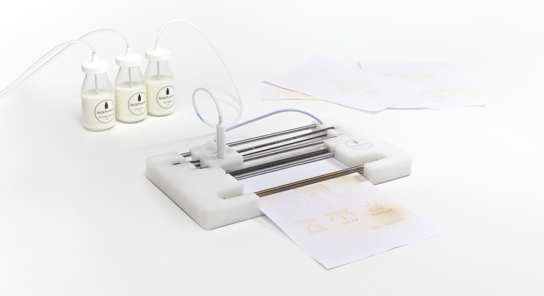

# MilkPrinter

A project I made while working as a freelance for [Nodesign](https://www.nodesign.net/)

(click for video)

Heavily based on my [Liplo](https://www.youtube.com/watch?v=GrPx1Ue8y_4) project, this printer prints using milk and reveals the print using a heater element.

Loads of fun to build, though I burned myself more than once! [Here](https://drive.google.com/open?id=0BxsBFm8YwdRANVRwbXY4bkVmTkE) for the first test I made, using my sturdy Liplo.

Special thanks to [Ufacto](ufacto.eu), which made it possible.

